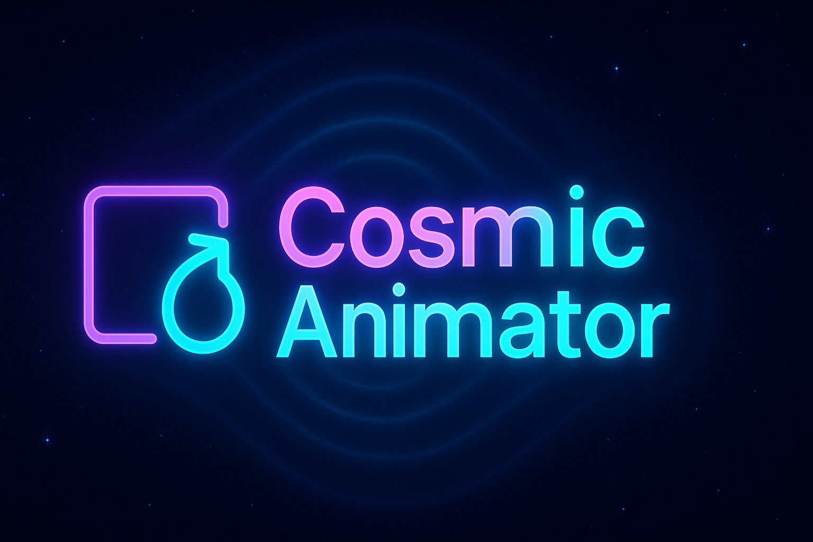
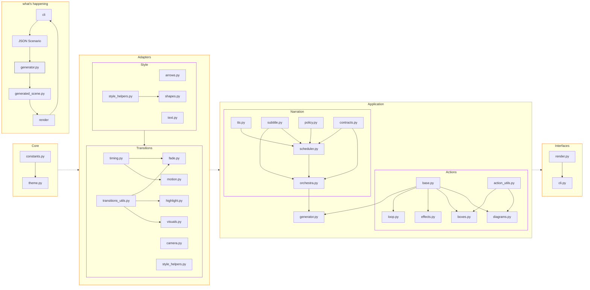
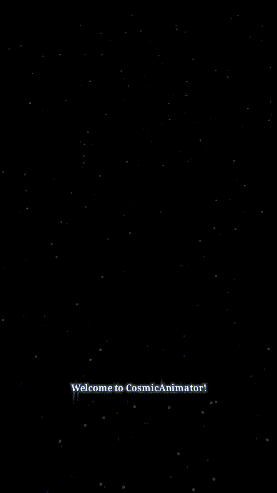

# CosmicAnimator



A theme-aware, Manim-based animation generator for short-form, neon-styled technical diagrams, with optional text-to-speech narration and on-video subtitles.

## ✨ Features

- **Theme system**: central palette/roles/strokes/glow/typography via `core/constants.py` and friends.
- **Style helpers**: Composable styling for shapes, text, and arrows (`adapters/style/*`).
- **Transitions**: Motion, fades, highlights, cameras, visuals, timing (`adapters/transitions/*`).
- **Narration**: TTS orchestration with optional subtitle overlay (`application/narration/*`).
- **Actions**: Declarative building blocks with a simple registry (`application/actions/*`).
- **Generator**: Produce a self-contained Manim scene from a JSON scenario (`application/generator.py`).

---

## 🏗 Project Architecture



---

## 🚀 Quick Start

### 1) Build the environment 

```bash
python3 -m venv coqui-env
source coqui-env/bin/activate
pip install --upgrade pip setuptools wheel
```

### 2) Install

```bash
pip install -e .
```

> You’ll also need FFmpeg for Manim renders.


### 3) Prepare a work/ directory

```bash
mkdir work
echo '{}' > work/scenario.json
```

### 4) Generate a scene from JSON

```bash
cosmicanimator --scenario work/scenario.json --out work/generated_scene.py --render
```
Higher quality 👇🏻
```bash
cosmicanimator --scenario work/scenario.json --out work/generated_scene.py --render -qh or -qm
```

---

## 🧪 Tests

`tests/` covers fast unit checks, integration wiring, and a light end-to-end import:

- **test_timing.py** — unit tests for timing config (modes, reverse/order flags).
- **test_style_helpers.py** — unit tests for color/role helpers and edge cases.
- **test_registry_sweep.py** — verifies actions registry is accessible and key actions are callable.
- **test_diagram_layout_ids.py** — checks `layout_branch` builds predictable IDs (`root`, `child*`, `arrow*`) and correct relative positions for up/down layouts.
- **test_apply_transition_pipeline.py** — smoke tests that `fade_in_group` / `slide_in` return valid `AnimationGroup` objects (no rendering).
- **test_negative_scenarios.py** — ensures invalid scenarios (missing keys, unknown action/transition) are rejected (exception or structured failure).
- **test_generator_integration.py** — integration test: generates a scene module from JSON via `write_scene_from_json` and asserts file creation.
- **test_e2e_scenario.py** — end-to-end check: imports the generated scene file and asserts the expected class is present (skips only if file emission is intentionally disabled).

Run with:

```bash
pytest -q
```

---

## 📜 Scenario JSON Reference

See:
- [Scenario Reference (Markdown)](docs/scenario-reference.md)

---

## 🤝 Contributing

1. Fork and create a feature branch.
2. Keep actions **pure** (return animations; do not call `scene.play` inside actions).
3. Prefer **theme-aware** helpers from `adapters/style` and `adapters/transitions`.
4. Add/extend tests under `tests/`.
5. Use descriptive docstrings and type hints.
6. Conventional commits encouraged.

---

## 🗺 Module Guide

- `core/` — declarative entities and theme wrapper.
- `adapters/style/` — style helpers for text, shapes, arrows.
- `adapters/transitions/` — motion, fades, highlighting, visuals, camera, timing.
- `application/narration/` — TTS + subtitles orchestration.
- `application/actions/` — actions registry and concrete actions.
- `application/generator.py` — JSON/entity → scene file.
- `interfaces/` — render + CLI wrappers.

---

## 🎬 Samples & Showcase

Here’s a quick preview of what CosmicAnimator generates:



For more sample animations and behind-the-scenes content, visit my socials:  

- [Instagram](https://www.instagram.com/_cosmicdeveloper?igsh=MW9rem41aG9sNjhmdg%3D%3D&utm_source=qr)  
- [YouTube](https://youtube.com/@cosmic.developer?si=nRzi9DqhKmy_86Yl)  
