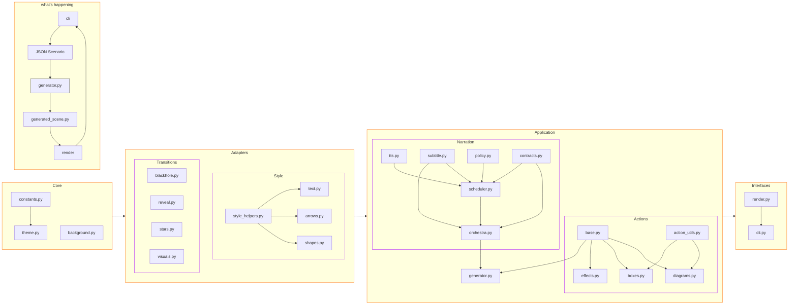

```mermaid
flowchart LR
 subgraph Core["Core"]
        C0["constants.py"]
        T0["theme.py"]
        B0["background.py"]
  end
 subgraph Style["Style"]
        ST1["style_helpers.py"]
        ST2["text.py"]
        ST3["arrows.py"]
        ST4["shapes.py"]
  end
 subgraph Transitions["Transitions"]
        BL["blackhole.py"]
        RV["reveal.py"]
        ST["stars.py"]
        VI["visuals.py"]
  end
 subgraph Adapters["Adapters"]
        Style
        Transitions

  end
 subgraph Actions["Actions"]
        AC["base.py"]
        AC1["action_utils.py"]
        AC2["diagrams.py"]
        AC3["boxes.py"]
        AC4["effects.py"]
  end
 subgraph Narration["Narration"]
        NV["tts.py"]
        NS["subtitle.py"]
        NG["orchestra.py"]
        PL["policy.py"]
        SCH[scheduler.py]
        CN[contracts.py]
  end
 subgraph Application["Application"]
        Actions
        Narration
        G["generator.py"]
  end
 subgraph Interfaces["Interfaces"]
        RE["render.py"]
        CLI["cli.py"]
  end
 subgraph Flow["what's happening"]
        CL["cli"]
        JS["JSON Scenario"]
        GN["generator.py"]
        GS["generated_scene.py"]
        RN["render"]
  end
    C0 --> T0
    ST1 --> ST2 & ST3 & ST4 
    AC --> AC2 & AC3 & AC4 & G
    AC1 --> AC2 & AC3
    NS --> SCH
    PL --> SCH
    SCH --> NG
    CN --> NG & SCH
    NS --> NG
    NV --> SCH
    NG --> G
    RE --> CLI
    CL --> JS
    JS --> GN
    GN --> GS
    GS --> RN
    RN --> CL
    Core -.-> Adapters
    Adapters -.-> Application
    Application -.->  Interfaces
    style Style stroke:#AA00FF
    style Transitions stroke:#AA00FF
    style Actions stroke:#AA00FF
    style Narration stroke:#AA00FF
    style GN stroke:#424242
    style Adapters stroke:#FF6D00
    style Core stroke:#FF6D00
    style Application stroke:#FF6D00
    style Interfaces stroke:#FF6D00
    style Flow stroke:#FF6D00
```